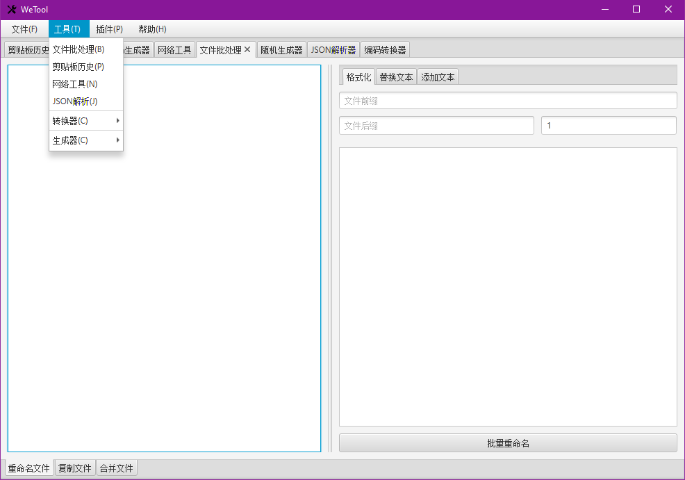
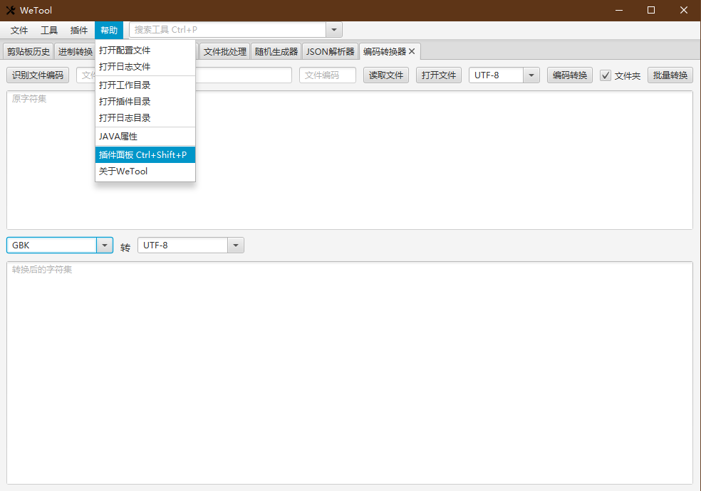

## WeTool 工具箱

`WeTool`是一款基于`JavaFX`开发的轻量级、简洁、可插件式扩展的通用工具箱。

### 主要功能

- 文件批量重命名
- 剪贴板历史
- JSON路径语法测试
- 识别文件编码，文件编码转换
- 二维码的解码与生成
- 随机字符生成器
- 支持自定义插件路径，支持手动加载插件
- 支持插件隔离加载
- 支持事件的发布与订阅（[查看内置事件](https://gitee.com/code4everything/wetool-plugin/blob/master/wetool-plugin-support/readme.md)）
- 插件管理面板
- Windows虚拟桌面触发角
- 支持数据库连接（[查看配置属性](https://github.com/alibaba/druid/wiki/DruidDataSource%E9%85%8D%E7%BD%AE%E5%B1%9E%E6%80%A7%E5%88%97%E8%A1%A8)）
- 支持监听鼠标键盘
- 支持暴露HTTP服务
- [更多功能来插件库查看哦](https://gitee.com/code4everything/wetool-plugin/tree/master/wetool-plugin-repository)

### 下载与使用

##### [下载WETOOL-1.3.0.ZIP](http://share.qiniu.easepan.xyz/tool/wetool/wetool-1.3.0.zip)

##### [查看更新历史](history.md)

##### 自己打包（或者下载上面的ZIP包）

```shell
git clone https://gitee.com/code4everything/wetool.git
cd wetool
mvn package [-D javafx.platform=[win|mac|linux]]
```
  
##### 运行（windows和mac平台双击对应jar包即可运行）

```shell
# windows平台
javaw -jar ./wetool.jar
# mac或linux平台
java -jar ./wetool.jar &
```
> 说明运行软件需安装有Java11及以上版本，另外日志保存在路径：`${user.home}/logs/wetool/wetool.log`。
  
##### 插件的安装（使用`Ctrl+Shift+P`打开插件面板即可安装插件）
 
如果是自己手动下载的插件，那么将插件放到当前工作目录的`plugins`目录下，重启程序即可

### 运行截图





### 使用小技巧

- 使用全局快捷键 `Ctrl+Alt+Enter` 显示或隐藏主界面
- 应用内使用快捷键 `Ctrl+数字` 选中指定位置的选项卡，数字 `9` 表示选中最后一个
- 关闭指定位置的选项卡：`Alt+数字`，数字 `9` 表示关闭最后一个
- 关闭所有未选中选项卡：`Ctrl+Shift+F4`
- 快捷键 `Ctrl+P` 搜索应用内工具，不支持输入中文，但是可以用拼音代替
- 隐藏主界面：按 `Esc` 取消窗体内控件的焦点，再按 `Esc` 隐藏窗体
- 关闭选中的选项卡：方法一，使用快捷键 `Ctrl+F4`；方法二，按 `Esc` 取消窗体内控件的焦点，按 `X` 键关闭TAB
- 快速聚焦到指定控件：1. 按 `Esc` 取消窗体内控件的焦点，2. 输入要聚焦控件的大概位置（如：`6`），3. 按 `Enter` 快速聚焦到该位置的控件

### 配置文件说明

程序会在启动时根据当前的系统名称加载当前工作目录下与之对应的配置文件`we-config-{}.json`，
其中`{}`可以为`win`、`mac`和`lin`分别对应`Windows`、`Mac`以及`Linux`平台，如上述文件不存在，那么将加载默认的配置文件`we-config.json`，
如果配置文件加载失败，程序将放弃运行，直接退出。

- 配置内容可参考：[we-config.json](we-config.json)
- 属性说明可参考：[WeConfig.Java](https://gitee.com/code4everything/wetool-plugin/blob/master/wetool-plugin-support/src/main/java/org/code4everything/wetool/plugin/support/config/WeConfig.java)

数据库配置：在配置文件中新增 dbConnections 字段，如其名，该字段为数组类型，数组中每个元素的配置属性请参考Druid，建议把name字段填上，便于识别，示例如下：

```json
{
    /*其他配置属性*/
    /*................*/
    "dbConnections": [
        {
            "name": "test",
            "url": "jdbc:mysql://localserver:3306/test?useUnicode=true&characterEncoding=utf-8&useSSL=true&serverTimezone=Asia/Shanghai",
            "username": "root",
            "password": "root",
            "initialSize": "1",
            "keepAlive": true
        },
        {
            "name": "local_prod",
            "url": "jdbc:mysql://localhost:3306/test?useUnicode=true&characterEncoding=utf-8&useSSL=true&serverTimezone=Asia/Shanghai",
            "username": "test",
            "password": "test",
            "initialSize": "0",
            "minEvictableIdleTimeMillis": 600000
        }
    ]
}
```

### 开发说明

所需环境

- JDK 11.0.5
- Maven 3.6
- Scene Builder 2.0
- IDEA 2019.3
- Lombok
- Git

开发调试过程中，建议运行[`WeApplicationTest`](src/test/java/org/code4everything/wetool/WeApplicationTest.java)主类，
而不是运行主类[`WeApplication`](src/main/java/org/code4everything/wetool/WeApplication.java)，
运行`WeApplication`类时产生的日志数据会被输出到文件中，而`WeApplicationTest`则只会输出到终端，并且会输出debug日志，方便开发调试。

### 插件开发

没有你需要的功能？没关系，一分钟快速了解插件的开发过程：[传送门](https://gitee.com/code4everything/wetool-plugin)

### 结语

关于插件的支持，纯粹是为了减轻本工具包的负担，毕竟本工具的宗旨是轻量级、轻量级、轻量级，而某些只会在特定场景下使用的功能则以插件的方式加载进来，可以极大缩减本工具包的大小，而不至于臃肿。

如果你觉得这个项目还不错，可将鼠标移动至`Star`处，轻轻点一下，以示支持哦^_^

欢迎提Issue，Pull Request，大家一起交流学习。
